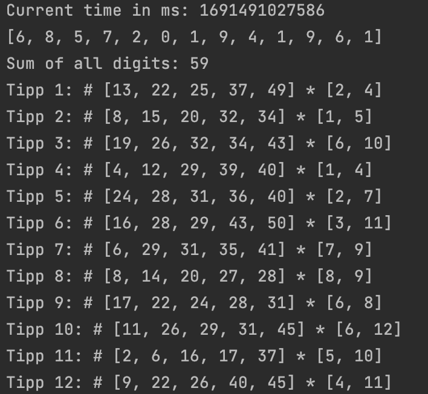
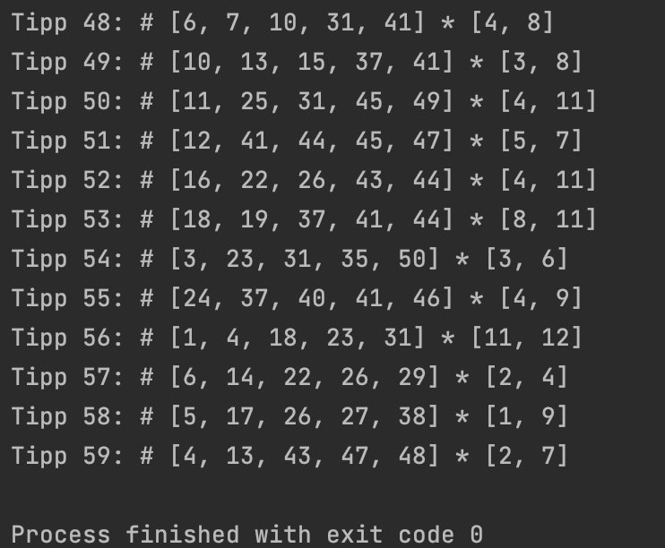

# Euromillion #
## Description ##
The program creates a random amount of euromillion tips (european gambling game) depending on the current time (checksum of current time in ms).

A tip consits of 5 random numbers between 1-50 and 2 "Sternzahlen" which are numbers between 1-12.

# Screenshots of output #

